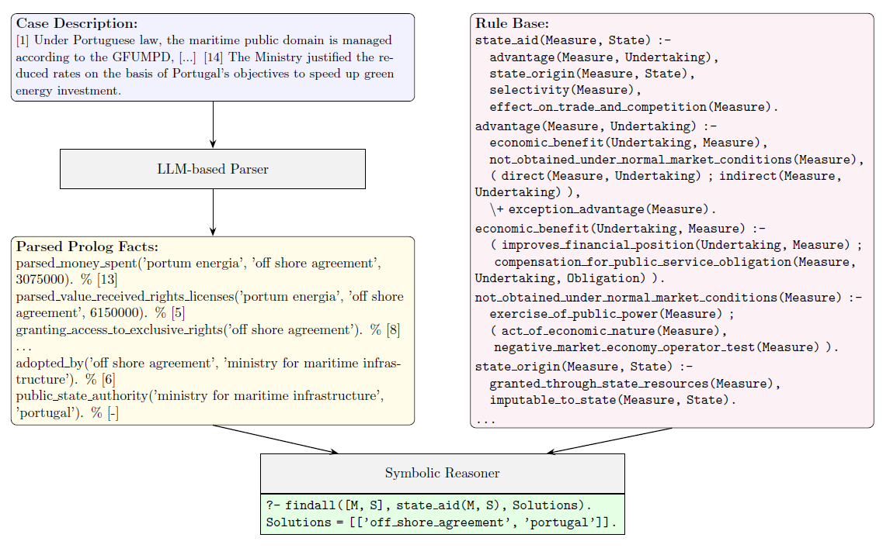

# Neuro-Symbolic Legal Reasoning

This project implements a neuro-symbolic approach to legal reasoning and evaluates
it on EU State Aid cases under Article 107(1) TFEU.

It combines:
- an LLM-based semantic parser (neural module) that turns case descriptions into
  structured Prolog facts, and
- a Prolog rule base (symbolic module) that derives legal conclusions from those
  facts.

The aim is to leverage LLMs' ability to handle unstructured text while preserving
the transparency, auditability, and reproducibility of formal rule-based reasoning.



## Rule Base and Data
For this project, a Prolog rule base (`data/rule_base_art_107/state_aid_107.pl`) representing two of the four criteria of Article 107(1) TFEU was created. It contains 153 unique predicates and is based on the Commission's [notion of State aid](https://eur-lex.europa.eu/EN/legal-content/summary/notion-of-state-aid.html).
Furthermore, 22 cases (either fictional or adapted from real-world decisions with
changed entities) were created, each with a case description and gold Prolog fact
representations (`data/cases`).

## Parser and Prompts
The LLM-based parser must extract all relevant relations using the predefined
predicate set. Because there are 153 possible predicates, the task is split into
several rounds. In each round, the LLM is prompted to look for specific facts
defined in a prompt template (`data/prompts`). As the Prolog rule base
requires consistent argument naming, the parser injects a memory block that tracks
previously used arguments. Outputs are validated with Prolog grammar and arity
checks, and invalid predicates trigger a retry prompt. If no predicate applies, the
model is instructed to output a single line: `% nothing`.
The parser was run with three models (`GPT-5`, `GPT-5-mini`, `GPT-4.1`).

## Evaluation
Evaluation is performed on the 22 cases across three dimensions:

- parsing correctness (predicate accuracy),
- source correctness (citation accuracy), and
- reasoning correctness (Prolog inference outcomes).

## Project structure

- `code/` - Python modules for parsing and evaluation
- `data/` - dataset, prompts, and Prolog rule base
- `results/` - model outputs and evaluation results

Each folder has its own `README.md` with detailed guidance and further explanations on the chosen approach and limitations.

## Requirements

- Python 3.10+ recommended.
- Dependencies listed in `requirements.txt`.
- SWI-Prolog installed and on PATH for reasoning evaluation.
- OpenAI API access for running the semantic parser.

## Quick start

1) Create and activate a Python environment.
2) Install dependencies:

```bash
python -m pip install -r requirements.txt
```

3) Create an environment file for the OpenAI API key:

On Windows:

```bash
copy code\parser\.env.example code\parser\.env
```

On Linux/macOS:

```bash
mv code/parser/.env.example code/parser/.env
```

Set `OPENAI_API_KEY` in `code/parser/.env`.

4) Run the parser:

```bash
python code\parser\semantic_parser.py --results_dir results --cases_dir data\cases --templates_dir data\prompts --model gpt-4.1
```

5) Evaluate outputs:

```bash
python code\evaluation\predicate_correctness.py --gold_dir data\cases --results_dir results
python code\evaluation\source_correctness.py --gold_dir data\cases --results_dir results
python code\evaluation\reasoning_correctness.py --results_dir results --rule_base data\rule_base_art_107\state_aid_107.pl
```